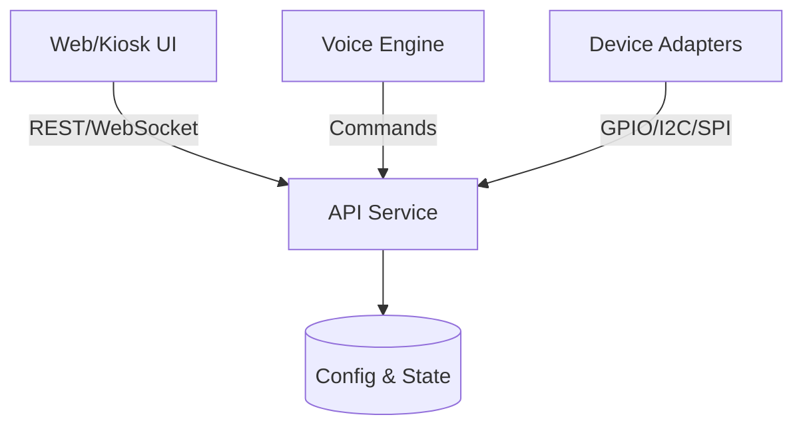

# Architecture

## Components
- **API (`src/api/`):** FastAPI application exposing endpoints for devices
  and system status.
- **Devices (`src/devices/`):** hardware drivers that communicate with GPIO
  pins and external modules.
- **UI (`src/ui/`):** static assets served to a kiosk or browser and built
  via `scripts/build_ui.sh`.
- **Voice (`src/voice/`):** hotword detection and speech processing
  bridging spoken commands to API calls.
- **Common (`src/common/`):** shared utilities used across modules.
- **Services (`services/`):** systemd unit files for deploying components
  on startup.
